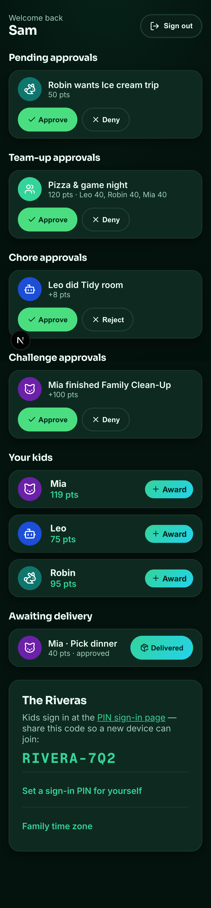
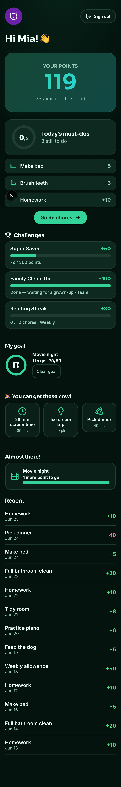
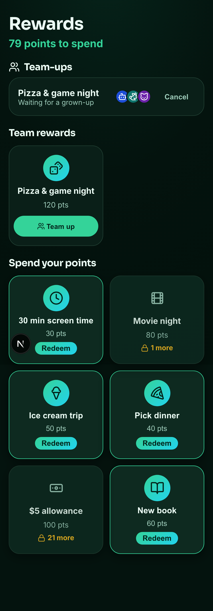

<div align="center">


# Pointsy

**A free, mobile-first PWA where parents reward kids for chores and good habits — and kids redeem their points for rewards they actually want.**

Multi-family · self-onboarding · privacy-first · open-source.

[**🚀 Try the live app**](https://pointsy-six.vercel.app) · [**🌐 Landing page**](https://highfivery.github.io/Pointsy) · [Spec](SPEC.md) · [Contributing](CONTRIBUTING.md)

> **Status:** active development, pre-1.0 (v0.x). The core experience is feature-complete
> and live; APIs and data shapes may still evolve before 1.0.

</div>

---

<div align="center">

&nbsp;&nbsp;

&nbsp;&nbsp;

</div>

---

## What is Pointsy?

Pointsy turns "do your chores" into a game the whole family can see. A **parent**
awards points from a tap-friendly catalog of chores and good behaviours; **kids**
watch their balance climb and spend it on rewards a parent has set — all
**configured inside the app**. No spreadsheets, no infrastructure, nothing to
install from an app store (it's an installable PWA).

Everything is built on an **append-only ledger**: balances are always derived from
history (`SUM(amount)`), so points can never silently drift, and every earn,
redemption, and adjustment is auditable.

## Features

- 👪 **Multi-family by design** — one deployment serves many families, each strictly
  isolated by `familyId`. Families self-sign-up; there's no per-family setup.
- 🧒 **Kid sign-in without accounts** — kids pick their avatar and tap a 4-digit PIN
  on a remembered device (with a family-code fallback). No kid email, ever.
- ✅ **Rich chore catalog** — categories, ~200 icons, per-chore daily/weekly limits,
  **core chores**, **take-turns rotation** between kids, and step-by-step
  **checklists**.
- 🙋 **Kid-logged chores** — kids submit completed chores; parents approve them from a
  queue (approving writes the points).
- 🎁 **Rewards & safe redemptions** — kids request a reward, points are _reserved_
  while pending, and a parent approves (points deduct) then marks it delivered.
  Negative balances are handled and redemptions are blocked while overdrawn.
- 🏆 **Challenges** — time-boxed goals (points earned, chores logged, or all-core-done
  days) that pay a bonus. Per-kid or whole-family, optional **weekly repeat**, and an
  optional parent-approval step before the bonus pays out.
- 🤝 **Team-up rewards** — kids pool points for a shared reward, splitting the cost
  evenly, with invites, live share previews, and a parent approval.
- 📈 **Kid hub** — a big count-up balance, a "today's must-dos" ring, earning streaks,
  a savings-goal ring, and an "you can get these now" rewards shelf.
- 👨‍👩‍👧 **Co-parents** — invite another parent with a one-time code (no email needed).
- 🔔 **Web Push** — opt-in notifications for approvals and awards (activates once VAPID
  keys are configured).
- 📱 **Installable PWA** — offline shell, home-screen icon, service-worker auto-update.
- ♿ **Accessible** — targets **WCAG 2.1 AA**; axe runs on every key screen in E2E.
- 🔒 **Privacy-first** — only parents have accounts/PII; kids are just a name, avatar,
  and PIN. Data export and family deletion are built in. See the
  [Privacy Policy](https://pointsy-six.vercel.app/privacy).

## Tech stack

Next.js 16 (App Router) · React 19 · TypeScript (strict) · CSS Modules · lucide-react ·
Neon Postgres + Drizzle ORM · jose (sessions) · argon2 (hashing) · Zod (validation) ·
Serwist (PWA) · Vitest + PGlite + Playwright/axe · GitHub Actions · Changesets.

The brand is a dark-only design system, **"Emerald Noir"** (emerald→cyan on
forest-black), defined as design tokens in [`app/globals.css`](app/globals.css).

## Getting started

Requires **Node 22+** (see [`.nvmrc`](.nvmrc)) and a Postgres database — a free
[Neon](https://neon.tech) project is the easiest path.

```bash
nvm use                      # Node 22
npm install
cp .env.example .env.local   # then fill in DATABASE_URL and AUTH_SECRET
npm run db:migrate           # apply migrations to your database
npm run dev                  # http://localhost:3000
```

### Configure the database

1. Create a free Postgres database at [neon.tech](https://neon.tech).
2. Copy the **pooled** connection string into `DATABASE_URL` in `.env.local`.
3. Generate a signing secret: `openssl rand -base64 48` → `AUTH_SECRET`.
4. Run `npm run db:migrate`.

> The DB client auto-selects the **Neon serverless** driver for `*.neon.tech` URLs
> and **node-postgres** for any other Postgres (local container, CI), so you can
> develop against plain Postgres too.

### Environment variables

| Variable                       | Required | Purpose                                                   |
| ------------------------------ | -------- | --------------------------------------------------------- |
| `DATABASE_URL`                 | ✅       | Postgres (Neon **pooled**) connection string.             |
| `AUTH_SECRET`                  | ✅       | Signs session JWTs (HS256). ≥ 32 chars.                   |
| `DIRECT_DATABASE_URL`          | —        | Neon **unpooled** URL, used by `db:migrate`.              |
| `NEXT_PUBLIC_VAPID_PUBLIC_KEY` | —        | Web Push public key. Push is a graceful no-op when unset. |
| `VAPID_PRIVATE_KEY`            | —        | Web Push private key.                                     |

See [`.env.example`](.env.example) for the full list.

## Deploy your own

Pointsy is built to fork and self-host on **Vercel + Neon**:

1. Fork this repo and import it on [Vercel](https://vercel.com).
2. Create a Neon database; add `DATABASE_URL` (pooled) and `AUTH_SECRET` to the
   Vercel project's environment variables.
3. Run migrations against your database (`npm run db:migrate` with the env set).
4. Deploy. Vercel serves the production build (`next build --webpack`, required so
   Serwist can inject the service worker).

Optionally add a VAPID keypair (`npx web-push generate-vapid-keys`) to turn on push
notifications.

## Scripts

| Command                           | Description                                      |
| --------------------------------- | ------------------------------------------------ |
| `npm run dev`                     | Start the dev server (Turbopack, SW disabled)    |
| `npm run build`                   | Production build (webpack — required by Serwist) |
| `npm run typecheck`               | `tsc --noEmit`                                   |
| `npm run lint` / `npm run format` | ESLint / Prettier                                |
| `npm test`                        | Unit + integration tests (Vitest + PGlite)       |
| `npm run test:coverage`           | Tests with coverage                              |
| `npm run test:e2e`                | Playwright E2E + axe accessibility checks        |
| `npm run db:generate`             | Generate a Drizzle migration from schema changes |
| `npm run db:migrate`              | Apply migrations                                 |
| `npm run icons:generate`          | Regenerate PWA icons from `public/icon.svg`      |
| `npm run changeset`               | Add a changeset for a user-facing change         |

## Architecture invariants

A few rules are non-negotiable (full detail in [`AGENTS.md`](AGENTS.md) and
[`SPEC.md`](SPEC.md)):

- **Server-only data access.** All DB access lives in Server Actions / Route
  Handlers; `DATABASE_URL` and `AUTH_SECRET` never reach the client.
- **Tenant isolation.** Every query is scoped by `familyId` from the **session**,
  never from client input — with integration tests asserting isolation.
- **Append-only ledger.** Balances are derived; corrections are new `adjust` rows.
- **Validate every boundary** with Zod; hash all secrets (argon2id); rate-limit PINs.
- **Role isolation** on every protected route, enforced in the proxy _and_ re-checked
  in the page.

## Quality & automation

- **CI** (`.github/workflows/ci.yml`): typecheck, lint, format, unit + integration
  tests, build.
- **E2E** (`e2e.yml`): Playwright across mobile + desktop with axe assertions.
- **Lighthouse** (`lighthouse.yml`): performance/accessibility budgets on PRs.
- **Release** (`release.yml`): Changesets-driven versioning + changelog.
- **CodeQL** + **Dependabot**: security scanning and dependency updates.
- **`.claude/`**: house rules (`AGENTS.md`), skills, and slash commands so the app can
  be specced, built, reviewed, and shipped with Claude following the project's
  conventions. Pointsy is, by design, built largely _with_ Claude.

## Contributing

See [CONTRIBUTING.md](CONTRIBUTING.md). In short: branch off `main`, use Conventional
Commits, add tests + a changeset, meet the accessibility bar, and keep CI green.

## License

[MIT](LICENSE) © Highfivery
